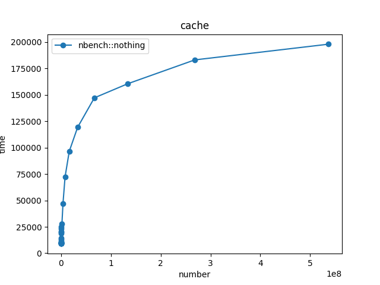
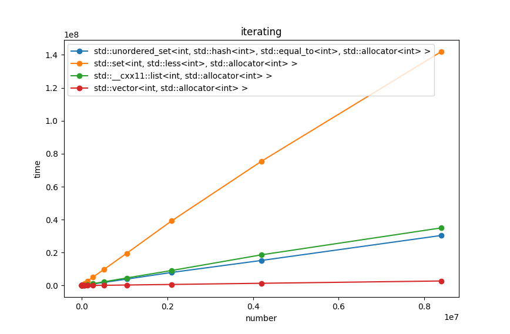
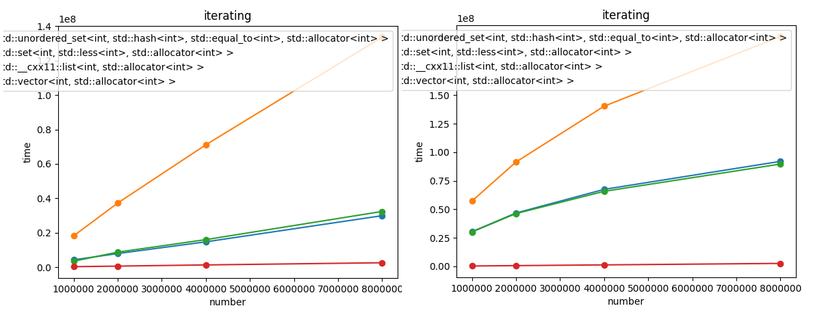

`plyometrics` is a header-only microbenmarking library targeted for embedded software development.


Quick start
-----------
The idea of microbenchmarks is that instead of full-scale deployment, you take a small portion of you application (or even simplified model of the particular problem) and measure the time needed to execute it.

You can use various examples to see `plyometrics` in action. They come with `CMakeLists.txt` file so compiling them is as simple as:

```
mkdir build-release
cd build-release && cmake -DCMAKE_BUILD_TYPE=Release .. && cd ..
cmake --build build-release
```

Note that we're building with `Release` mode, this is needed because you want you code to be optimized as closely as in the production but it also has some drawbacks that will be covered later. After that you can run one of the benchmarks, for example:

```
./build-release/examples/cpu_phenomenons
```


Examples library
----------------
This project tries to follow "battery included" philosophy and therefore come with a number of [examples and documentation](examples/). They have two purposes, you can run them in order to quickly assess new hardware or learn about various phenomenons that goes with performance engineering.


Installation
------------
`plyometrics` is a header-only library so while the samples are compiled using CMake, you can easily integrate it into you own, customized build system by just copying `plyometrics` directory and optionaly the `contrib` which is the place for some usefull scripts.

When you have the code in place, you can include `plyometrics.hpp` header and write the `main` function.

```cpp
#include "plyometrics/plyometrics.hpp"

int main(int argc, const char* argv[])
{
    plyometrics::run_all(argc, argv);
}
```

And there you have it, now you can write your first benchmark.


Writing simple benchmarks
-------------------------
You can write new benchmarks using `NBENCHMARK` or `NBENCHMARK_P` macro.

```cpp
NBENCHMARK(allocate_by_make_shared)
{
    while (loop)
    {
        auto p = std::make_shared<int>(5);
        plyometrics::escape(p.get());
    }
}
```

`NBENCHMARK`'s argument is the name of your test that will later be used when presenting the results. Within benchmark's body, a variable called `loop`, for now, we're using it to construct `while` loop where you put time critical code you want to measure.

If your test requires some initialization, say, generating some dataset, you can simply do that outside the `while` loop, like this:

```cpp
auto random_data = plyometrics::random_range(100);
auto v = std::vector<int>{random_data.begin(), random_data.end()};

while (loop)
    std::sort(v.begin(), v.end());
```

Parametric tests
----------------
Tests can be parametrized with two ways: *type* and *number*. Both can be done using `NBENCHMARK_P` macro and a trait called `spec`. `spec` can be defined using `plyometrics::spec`. After defining some types, they are accessible through `loop.type()` function. `loop.type()` constructs current type, forwarding its parameters to the constructor.

```cpp
NBENCHMARK_P(constructing_stuff, plyometrics::spec::with_types<int, float, Widget>)
{
    while (loop)
        loop.type(1);
}
```

Above example will generate three tests, each with different type.

Another type of parameter is the *number*. It can be constructed using `plyometrics::spec::with_range<>` which takes two parameters: `from` and `to` and uses them to create a geometric range of numbers by multiplying previous value by 2.

```cpp
NBENCHMARK_P(constructing_sequence_containers, plyometrics::spec::with_types<std::vector<int>, std::list<int>>::with_range<1, 128>)
{
    auto sequence_data = plyometrics::sequence_range(loop.number());

    while (loop)
        plyometrics::use(loop.type(sequence_data.begin(), sequence_data.end()));
}
```

this will give you following tests:

```
constructing_sequence_containers / std::__cxx11::list<int, std::allocator<int> > [1]: 42ns
constructing_sequence_containers / std::__cxx11::list<int, std::allocator<int> > [2]: 62ns
[...]
constructing_sequence_containers / std::__cxx11::list<int, std::allocator<int> > [128]: 3336ns

constructing_sequence_containers / std::vector<int, std::allocator<int> > [1]: 43ns
constructing_sequence_containers / std::vector<int, std::allocator<int> > [2]: 43ns
[...]
constructing_sequence_containers / std::vector<int, std::allocator<int> > [128]: 76ns
```


Generating datasets
-------------------
Maybe you noticed `plyometrics::sequence_range` in previous example. It can be used to generate lazy ranges that can be used to feed measured algorithm. It takes `size` as an argument. Similar range is `random_range` but it gives pseudo-random numbers.


Visualizing parametric tests
----------------------------
You can visualize parametric tests by utility script from `contrib` directory. Just pass `-x` argument (JSON output) to your benchmark and pipe the result through `visualize.py`.

```
cmake --build build-release/ && ./build-release/example -b 'cache' -x | contrib/visualize.py
```



If your benchmark is also type-parameterized, the chart will include all types used.




Heap fragmentation
------------------
In the real world, your app's heap might be fragmented. To simulate this, you can use `plyometrics::fragmentize_heap` function. It returns an object which you should keep in the scope of your test.

```cpp
BENCHMARK("iterating").types<
    std::vector<int>, std::list<int>,
    std::set<int>, std::unordered_set<int>
>().range(1e6, 1e7) = [](auto& loop)
{
    // keep it in this scope
    auto fragmentized = plyometrics::fragmentize_heap();

    auto data = plyometrics::sequence_range(loop.number());

    while (loop)
        for (auto i : loop.type(data.begin(), data.end()))
            plyometrics::use(i);
};
```

See the difference in iterating of various containers when memory is fragmented (right) and where it is not (left).


